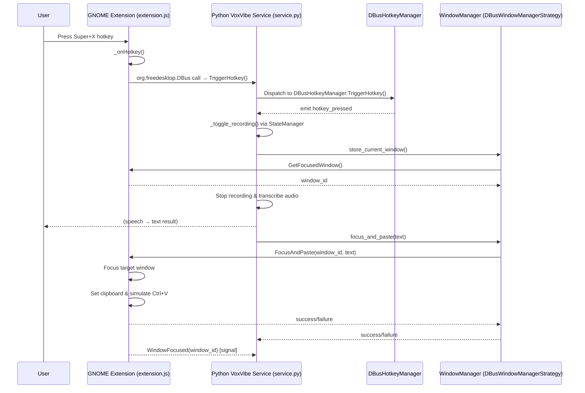

# VoxVibe – GNOME Shell Extension DBus Interaction (Hotkey + Window Manager)

## Description
1. **Hotkey Trigger** – The user presses *Super + X*. The GNOME extension captures this and asynchronously invokes the Python service’s `TriggerHotkey` DBus method.
2. **Recording Toggle** – `DBusHotkeyManager` inside the Python service emits `hotkey_pressed`, which the service maps to `_toggle_recording()`.
3. **Window Tracking** – When recording starts, the service asks the window-manager strategy (DBus) to remember the current focused window via `GetFocusedWindow`.
4. **Transcription** – After the user stops speaking, audio is transcribed inside the Python service.
5. **Paste Back** – The service sends the text back to the previously focused window through the extension’s `FocusAndPaste` method. The extension focuses the window, sets the clipboard content, and simulates paste.
6. **Signals** – The extension continually emits `WindowFocused` to inform the service of focus changes (not yet consumed but available).

This diagram reflects the interaction **when only the DBus hotkey manager and DBus window manager strategy are enabled**.
